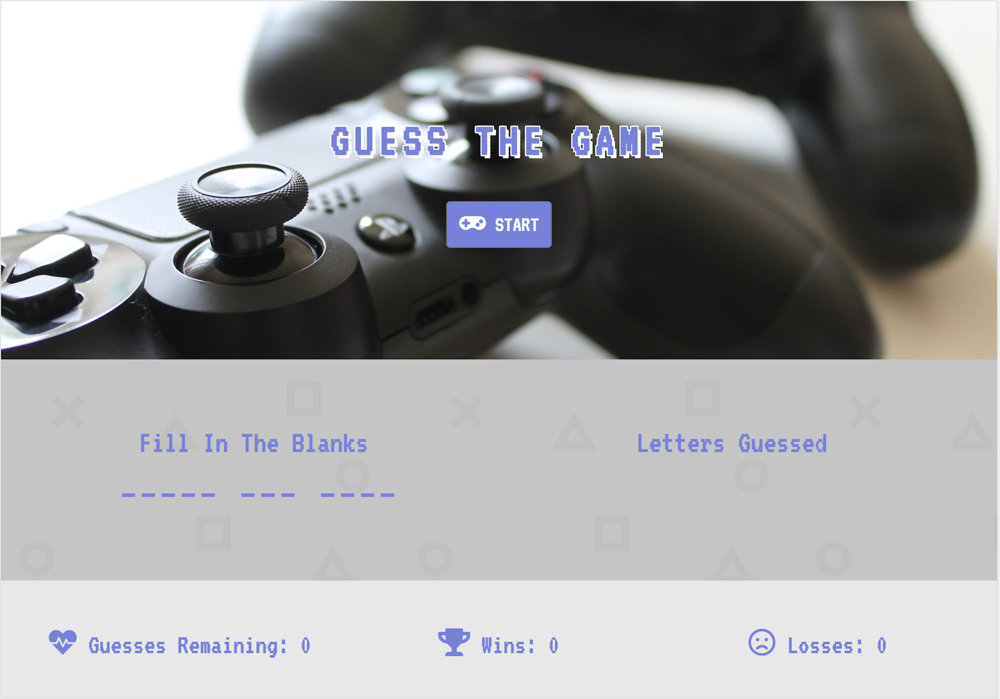

# Word-Guess-Game

## Live Link
https://dcdi22.github.io/Word-Guess-Game/

## Description
-Video game themed word guessing game
1. Press 'Start' to begin playing
1. Using your keyboard guess the letters of the chosen video game title
1. Try to Win Win Win!
**Best of Luck**

## Requirements
1. Create a hangman game that inputs key presses from the user
2. Track guesses and number of wins
3. Win result in an increase in the win count and both wins and losses result in the loading of a new word

## Technologies Used
- HTML/CSS
- JavaScript/Jquery for DOM manipulation
- Web Fonts (from Google Fonts)

